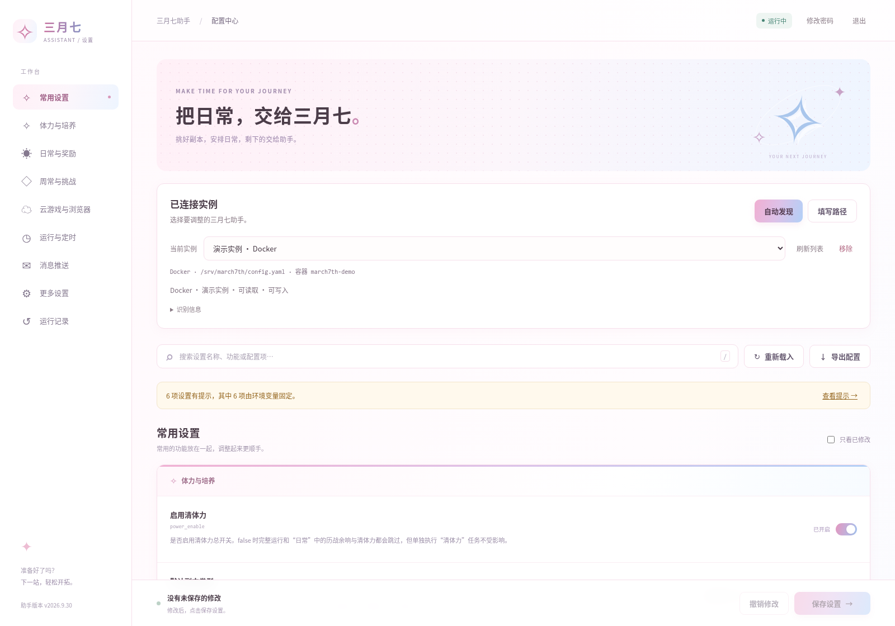

# March7thAssistant Web

**三月七助手的非官方 Linux 配置面板。** 在浏览器里选择运行实例、编辑配置、管理登录密码；既支持发现部署，也支持直接填写配置文件路径。

不是三月七运行引擎，不代替上游，也不提供游戏账号登录。只支持 Linux，不提供 Windows、macOS 或 Android 专门适配。

## 界面预览



## 功能

- 浅粉到淡蓝的界面，适配电脑和手机。
- 拖动普通界面不选中文字；输入框、配置键名和路径仍可选中复制。
- 切换设置分类自动回到页面顶部；向下滚动后可点击右下角「回到顶部」。
- Docker、本机源码、PM2/systemd 托管识别；展示识别依据和权限状态。
- 自动发现之外，提供独立的**手动配置路径**入口。
- 开关、枚举、副本、体力计划和消息推送配置；复杂对象可用 JSON 编辑。
- 读取当前安装的默认配置和副本资料，不把内置资料冒充成最新版本。
- 保存前确认、原配置备份、目标绑定、多窗口修改冲突检查与共享配置保护。
- 网页修改密码、管理员本机重置；不在网页返回现有敏感凭证。

## 安装

Web 应部署在三月七所在的 Linux 机器上。浏览器里填写的是**服务器路径，不是访问者电脑的路径**。Docker 与原生安装二选一；已有面板占用 `18077` 时，请先为新部署设置不同的 `PORT`，不要重复占用端口。

### Docker Compose

需要 **Linux amd64、rootful Docker Engine 20.10+ 和 Docker Compose 2.20+**，运行命令的管理员须有本机 Docker 权限。镜像内包含 Node.js、Docker CLI 和宿主桥接程序，宿主不用另外安装 Node.js，也不会安装新的宿主常驻服务；镜像不包含三月七引擎、浏览器或 Docker daemon。

该模式可以接入**宿主 PM2、systemd、源码/venv/uv 和 Docker 实例**，不是 Docker-only。仅支持同机、无 user namespace 重映射的 rootful Linux Docker；不承诺 rootless、`userns-remap`、Docker Desktop、远程 Docker daemon 或 ARM64 可用。

**这是接近宿主 root 权限的管理容器，只供可信管理员使用。** Compose 共享宿主 PID、cgroup 和网络，添加 `SYS_ADMIN`、`SYS_CHROOT`、`SYS_PTRACE`、`DAC_READ_SEARCH`、`DAC_OVERRIDE`、`SETUID`、`SETGID`、`KILL`，并关闭默认 seccomp/AppArmor 限制。虽然没有启用 `privileged`、也没有挂载整个宿主 `/`，仍不是安全沙箱；Docker socket 同样具有高权限。

镜像地址为 `ghcr.io/cchanlan/march7thassistant-web:latest`，公开提供匿名拉取，不需要 GitHub 账号或 `docker login`：

```sh
docker pull ghcr.io/cchanlan/march7thassistant-web:latest
```

拉取失败时请保留完整错误信息（隐藏凭据），并核对镜像地址、服务器访问 GHCR 的网络和 CPU 架构；不要把所有拉取错误都当成私有镜像。

在服务器终端执行：

```sh
mkdir -p march7th-web
cd march7th-web
curl -fL https://raw.githubusercontent.com/cchanlan/march7thassistant-web/main/compose.yaml -o compose.yaml
docker compose up -d --wait
docker compose exec -T web cat /var/lib/march7th-web/access.txt
```

默认地址为 `http://127.0.0.1:18077`。远程浏览器可先在自己的电脑运行以下命令，再打开该地址：

```sh
ssh -N -L 18077:127.0.0.1:18077 admin@服务器地址
```

首次登录后，点击右上角「修改密码」。`access.txt` 仅供初次领取，直接编辑它不会修改密码；自定义密码后该文件会被清理。忘记密码时，在部署目录的交互终端执行：

```sh
docker compose exec web node tools/reset-password.mjs
```

按提示输入两遍新密码并确认，无需重启面板；不要把密码写入命令参数。

镜像地址为 `ghcr.io/cchanlan/march7thassistant-web:latest`，**无需登录即可拉取**。同时提供 `sha-完整提交号` 标签，便于固定版本。

#### 宿主目录和用户服务

扫描路径、PM2 目录及手动配置路径都填写**宿主机真实绝对路径**，不要添加 `/host` 前缀。默认扫描 `/root`、连接 `/root/.pm2`，systemd 用户 manager 使用宿主 UID `0`。需要管理其他用户时，在 `compose.yaml` 同目录创建或编辑 `.env`，例如：

```dotenv
M7A_SEARCH_ROOTS=/srv/starrail:/home/alice
PM2_HOME=/home/alice/.pm2
M7A_HOST_UID=1000
```

将示例路径与用户替换为实际值，用 `id -u alice` 获取准确 UID。用户级 systemd 服务要求该用户的 manager 已经运行；面板不会创建 manager 或启用 linger，系统级服务仍由系统 manager 管理。容器本身保持 `user: "0:0"`，不要把它改为该 UID。

需要开放内网时，在同一 `.env` 中设置 `HOST=0.0.0.0`；需要改端口则设置 `PORT=18078`。HTTPS 反代同时设置 `M7A_PUBLIC_ORIGIN=https://settings.example.com`，并保留 Host 请求头。修改后执行：

```sh
docker compose up -d
```

采用 host 网络，不添加 `ports` 映射。**不要将 HTTP 端口直接暴露到公网。** 不要添加 `init: true`、tini 或替换入口命令，容器主进程必须直接运行 Node；停止宽限期为 3 分钟。

#### 状态与备份

Compose 只挂载本机 Docker socket 和独立的 `state` 命名卷。密码、连接、备份与缓存位于容器 `/var/lib/march7th-web`，**不要绑定原生部署正在使用的 `.state`**。同一宿主仅运行一个用于管理实例的面板；检测到另一个同镜像或已识别的面板时，会阻止同时管理，即使另一个面板没有挂载实例配置。其他共享宿主 PID 且拥有宿主命名空间访问能力的容器无法排除冲突时，也会保持只读。迁移或排错需临时并存时，各副本仍须使用不同 Compose project（`docker compose -p 名称 ...`）、状态卷和端口，不能借此绕过保护。

在没有保存任务进行时，备份整个状态目录与部署配置：

```sh
umask 077
backup="backups/$(date +%Y%m%d-%H%M%S)"
mkdir -p "$backup"
cp compose.yaml "$backup/"
[ ! -f .env ] || cp .env "$backup/"
docker compose stop web
docker compose cp web:/var/lib/march7th-web/. "$backup/state"
docker compose start web
```

请确认备份命令成功后再做迁移。备份包含敏感配置，妥善保存，不要上传公开仓库；不要使用 `docker compose down -v`，它会删除状态卷。这里只停止和启动 Web 面板，不操作三月七运行实例。

### 原生安装

需要 **Linux、Node.js 18.18+**，建议使用仍受支持的 Node.js LTS。管理 Docker 还需要本机 Docker CLI 和访问本机 Docker daemon 的权限；管理原生实例需要能读取目标进程信息、配置，并具有对应托管服务的控制权限。

```sh
git clone https://github.com/cchanlan/march7thassistant-web.git
cd march7thassistant-web
npm ci
npm start
```

默认监听 `127.0.0.1:18077`。在同机浏览器打开该地址，远程使用时通过 SSH 转发或 HTTPS 反向代理访问。需要开放内网监听时：

```sh
HOST=0.0.0.0 PORT=18077 npm start
```

**不要把内网 HTTP 端口直接映射到公网。** Web 进程的文件权限、Docker 权限和服务管理权限非常高，应仅供可信管理员使用。

#### 领取初始密码

首次启动生成 `.state/access.txt`，在项目目录执行：

```sh
node -e "console.log(require('fs').readFileSync('.state/access.txt','utf8').trim())"
```

该文件仅供初次领取，**直接编辑不会修改登录密码**。自定义密码后仅保存校验值，初始领取文件会被清理。

#### 后台运行

安装 PM2 后可使用仓库提供的配置，默认只监听本机回环地址：

```sh
pm2 start ecosystem.config.cjs
pm2 save
```

首次启动就需要通过内网访问时，改用以下命令：

```sh
HOST=0.0.0.0 pm2 start ecosystem.config.cjs
pm2 save
```

也可使用 systemd：先编辑 `examples/march7th-web.service`，把用户、安装目录和 Node 路径占位符替换为实际值，然后执行：

```sh
sudo cp examples/march7th-web.service /etc/systemd/system/march7th-web.service
sudo systemctl daemon-reload
sudo systemctl enable --now march7th-web.service
```

这里管理的是 **Web 面板自身**，与被连接的三月七实例是两回事。PM2 和 systemd 二选一，不要重复启动占用相同端口的 Web 进程。

## 接入三月七

### 自动发现

1. 登录后点击「自动发现」。
2. 可填写**宿主服务器**扫描目录，每行一个；留空时使用 `M7A_SEARCH_ROOTS` 或当前服务用户的主目录。Docker 容器内路径不填在这里，Docker 发现会单独检查容器。
3. 查看候选的程序目录、配置路径和识别依据，选择后连接。

发现过程不启动三月七、不重启服务，也不会为了探测而启动 PM2 daemon。扫描有深度、数量和超时限制，不是全盘检索。部分宿主目录不存在或不可访问时，其余目录与 Docker 发现仍会继续。

Docker 的镜像名、容器名和标签只用于筛选候选，最终仍检查实际程序结构与配置。**完全改名的自定义镜像不保证自动出现**，请通过手动入口填写容器名。没有权限和没有运行实例不是一回事：无法确认时会显示诊断，不把未知状态当成已停止。

Docker 发现会检查工作目录、可识别启动脚本所在目录和配置挂载目录。候选未通过校验时，页面会给出手动接入提示，详细阶段与错误码可在 `docker compose logs --tail=100 web` 中查看。请使用仓库提供的完整 `compose.yaml`；只映射网页端口、不挂载 Docker socket，不能发现其他容器。宿主权限核验失败时不会放开写入或重启保护。

### 手动填写配置路径

1. 点击「填写路径」。
2. 填写 Linux 服务器上实际的 YAML 配置完整路径，例如 `/srv/starrail/config.yaml`。
3. 配置与程序目录分开时，在高级选项补充安装目录。
4. 配置由 Docker 使用，或同一路径对应多个容器时，补充准确的容器名。
5. 命名卷或容器可写层没有可填写的宿主文件路径时，勾选高级选项「填写的是容器内路径」，填写容器内的配置路径和容器名；此时可选安装目录也指容器内部。
6. 查看检测结果和权限状态后连接。

程序会解析真实路径、核对 YAML 内容、安装信息及运行实例。手动输入不是跳过校验，也不意味着自动获得文件或服务权限。

### 仅编辑文件

确实只有配置文件、无法接入程序管理器时，可主动选择「仅编辑文件」。每次保存都需要确认没有运行中的程序正在使用或写入它。

此模式**只保存文件，不启动/停止程序，不保证自动热加载**。已明确检测到程序运行中或存在其他配置使用者时仍会禁止保存，不允许用此选项绕过运行保护。不要将它用于未经确认的在线任务。

## 识别和应用的边界

| 目标 | 识别依据 | 保存行为 |
| --- | --- | --- |
| Docker | 程序源码标志、版本、实际入口与工作目录、CONFIG_PATH、镜像/容器身份和挂载文件身份 | 用户确认后仅停止所选独立实例、备份写入、恢复原运行状态 |
| 本机源码（pip / venv / uv） | 程序根目录、真实配置路径、进程 cwd/命令行/解释器 | 未托管运行中只读；确认已停止后可保存 |
| PM2 托管 | 已有 daemon、条目路径与进程身份交叉验证 | 仅管理已验证条目，不启动不存在的 daemon |
| systemd 托管 | 已验证 unit 启动信息、目录及进程归属 | 仅管理该目标；权限不足或身份不明时只读 |
| 仅配置文件 | 手动路径和配置特征 | 显式确认停止后仅写文件，不宣称已应用 |

- 原本停止的目标，保存后仍保持停止。
- 原生部署写入失败会尝试恢复原配置；如果连配置恢复也失败，实例保持停止，请先使用备份修复，不会带着未确认的配置自动启动。
- 镜像模式采用更保守的故障锁：桥接写入报错、超时或断连后，当前目标保持停止，面板只读，其他实例不会继续被停止或写入。请先核对该次备份、目标配置与运行状态，必要时按原部署方式恢复实例，再在面板部署目录执行 `docker compose restart web`。重启面板不会自动启动三月七实例。
- 识别出三月七文件，不等于有权限控制它；是否可读取、可写入、可安全恢复会分别展示。
- 文件、目录 bind 挂载与命名卷需要分清。可核验宿主存储的本机 bind/local volume 支持保存；只读挂载、无法核验的卷子路径或插件卷、容器可写层保持只读。远程 Docker context 不在本版支持范围内。
- **每个实例应使用独立配置文件。** 其他容器、相关本机进程或其他已连接配置指向同一文件时，禁止单独保存；补填容器名和选择「仅编辑文件」均不能绕过。其他容器尚未接入面板、甚至已经停止，也会参与挂载检查。
- 同一目录或同一卷里存放不同配置文件可以分别管理；软链接、硬链接或 bind/volume 不同入口指向同一物理文件不算独立配置。
- 共享检查不沿用自动发现的名字筛选或候选上限；必要元数据无法读取、检查超过资源预算或检测到身份变化时，暂不允许保存。检查只查询必要的进程、挂载、入口与配置声明，不读取其他实例的账号配置正文。
- Docker 所选目录必须与真实工作目录、入口和配置声明对应。支持直接 Python、简单 uv 以及已核验的上游环境设置后转发入口；自定义 shell、改变工作目录的 uv 参数或无法证明的包装器只读。
- 目标绑定包含文件身份。同内容的新文件替换、挂载变化或停止后出现新的共享者都会阻止本次写入；不会为了保存而顺便停止其他实例。
- 原生图形界面部分设置支持监听文件，命令行也可能在下一轮重读；面板不会因此承诺所有当前任务立即热更新。
- 动态拼接配置路径、自定义包装器、无法检查的命名空间或未知管理协议可能降级为只读。请补充明确路径或使用原部署方式管理，不要依赖猜测。
- 这不是操作系统级排他锁，不能阻止外部工具在最后一次检查后强行启动程序或改写文件；从未接入、当前未运行且没有可见使用证据的原生安装也无法凭空发现。不要让外部任务与面板同时管理同一份配置。

## 配置与安全

| 环境变量 | 默认值 | 说明 |
| --- | --- | --- |
| `HOST` | `127.0.0.1` | Web 监听地址；`0.0.0.0` 开放所有 IPv4 接口 |
| `PORT` | `18077` | Web 端口；host 网络下直接使用宿主端口 |
| `M7A_STATE_DIR` | 原生：项目 `.state`；镜像：`/var/lib/march7th-web` | 面板自己的密码校验值、连接记录、备份与缓存；修改镜像内路径时须同步状态卷挂载位置 |
| `M7A_SEARCH_ROOTS` | 原生：服务用户主目录；Compose：`/root` | 宿主 Linux 扫描目录，多个路径用冒号分隔 |
| `M7A_PUBLIC_ORIGIN` | 空 | HTTPS 反代的完整来源，例如 `https://settings.example.com` |
| `M7A_READ_ONLY` | `0` | 设为 `1` 禁止修改实例配置，用于预览/检查；不降低容器宿主权限 |
| `PM2_HOME` | 原生：服务用户 `.pm2`；Compose：`/root/.pm2` | 需要接入的宿主 PM2 daemon 目录 |
| `M7A_CONTAINER` | 原生：`0`；镜像：`1` | 启用宿主桥接；原生安装不要启用，容器安装不要关闭 |
| `M7A_HOST_BRIDGE` | 项目 `tools/host-bridge/m7a-host-bridge`；镜像：`/usr/local/bin/m7a-host-bridge` | 容器内静态桥接程序路径；原生安装无需设置 |
| `M7A_HOST_UID` | 容器：`0` | 宿主 systemd 用户 manager 的准确 UID，不是容器运行用户 |
| `NODE_ENV` | 镜像：`production` | Node.js 生产运行环境 |

Compose 还接受 `M7A_IMAGE`（默认 `ghcr.io/cchanlan/march7thassistant-web:latest`），可在 `.env` 中改为指定镜像标签或 digest；它不是面板运行环境变量。Compose 中 `M7A_CONTAINER`、`M7A_HOST_BRIDGE` 和 `M7A_STATE_DIR` 已固定为镜像对应值，无需在 `.env` 重复设置。

反向代理应保留 Host，读取超时至少 180 秒，并配置 `M7A_PUBLIC_ORIGIN`。不支持把面板部署在 URL 子路径下。

镜像健康检查只请求不需要登录的 `/api/session`，不发现或读取实例；`healthy` 不等于宿主权限或每个目标均可用。请以登录后的检测结果为准。

状态目录中的 `backups/` 和「导出配置」包含完整配置，可能含凭证，请勿分享。备份不会自动删除。状态目录不得放进公开 Git 仓库。

网页登录采用 scrypt、HttpOnly/SameSite Cookie、CSRF、同源校验与登录限速。它不是多租户平台，也不是文件权限或 Docker 的安全沙箱。不要交给不可信用户，更不要提供未经保护的 Docker socket。

### 修改/重置密码

登录后点击右上角「修改密码」，输入当前密码和两遍新密码（8～128 个字符）。成功后所有旧会话失效。

忘记密码时，在服务器项目目录的交互终端执行：

```sh
node tools/reset-password.mjs
```

隐藏输入两遍新密码，输入 `y` 确认；无需重启服务。如果使用自定义 `M7A_STATE_DIR`，运行命令时也要使用相同设置。不要把密码写在命令行参数里。

## 更新

**Compose 部署**在部署目录执行，保留现有 `.env` 和状态卷：

```sh
docker compose pull web
docker compose up -d
```

如果固定了 `M7A_IMAGE`，先将其改为需要的版本。只更新面板，不更新三月七引擎；更新前建议按上文备份状态。

**原生部署**更新代码和依赖后，按原来的运行方式重启面板：

```sh
git pull --ff-only
npm ci
pm2 restart march7th-web
```

使用 systemd 时，最后一行改为 `sudo systemctl restart march7th-web.service`；前台运行则结束旧面板后执行 `npm start`。

三月七本身更新后，重新读取所选实例时会核对其当前字段定义、版本和副本资料。读取失败会提示，不会自动覆盖用户配置。内置中文标题仅作展示补充；缺少可信定义的未知字段保持只读。

## 验证范围

镜像目标为 `linux/amd64`，ARM64 尚未验证。已在 Linux 6.1、cgroup v2、Node.js 24.21.0、Docker 27.5.1 的隔离宿主中通过 **39 组 HTTP 回归**：

- Docker 单文件/目录 bind、命名卷、数值 UID:GID、0640 权限、停止实例、只读挂载与入口核验。
- 宿主 PM2、systemd 系统/用户服务、venv/uv，以及中文、emoji 和带空格的路径。
- 多实例独立保存、跨目标/跨会话快照、并发与旧窗口冲突、软硬链接和跨部署共享保护。
- 仅隔离 PID 的共享使用者、停止后新增共享者、客户端断连加 SIGTERM 时的保存与恢复。
- 缺少宿主权限时只读、改密与重建后持久化，以及原生 Node 部署回归。

另外通过镜像内 Docker CLI 27.5.1 对 Docker Engine 20.10.24 的版本协商和定向元数据读取检查；这不等同于在 20.10 上重跑完整矩阵。故障闭锁、原地写入恢复、严格 JSON/Unicode、私有管道和用户管理器端点另有隔离检查。测试使用无账号配置探针，不运行游戏任务。

以下是**面板直接运行在宿主机时**的既有验证记录：

已在 Linux、Node.js 24.19、Python 3.12、Docker 20.10.24、PM2 6.0.8、systemd 252 上验证：

- Docker 单文件/目录 bind、命名卷、数值 UID:GID、停止容器、只读挂载、改名容器及无关目录排除。
- 手动 Python/venv、uv、真实独立 PM2 daemon 和真实 systemd 单元。
- 手填带空格的配置路径、纯文件确认、错误 YAML、错误路径、不同目标的快照隔离。
- 网页 HTTP 保存后确实停止和恢复目标，新进程通过真实三月七 Config 模块读取到修改值；原本停止的目标不会被启动。
- 同时运行多个 Docker 与 PM2 实例，逐一保存、交叉快照、跨登录会话、并发保存与旧窗口冲突；非目标配置和进程保持不变。
- 共享宿主文件、共享卷内同一文件、Docker/PM2 跨部署共享、未接入的软硬链接使用者与错误安装目录均拒绝保存；同卷不同配置仍可分别保存。
- 真实镜像 entrypoint 兼容、未知工作目录包装器只读、Docker 清单不可读、停止后新增共享者、同内容换 inode 和「仅编辑文件」绕过回归。

测试使用隔离配置、同镜像和只读配置的探针程序，不使用游戏账号，不代表所有游戏任务已经逐项实跑。其他版本会做能力检查，无法可靠核验时只读，不猜测成功。

## 来源与许可证

项目采用 **GPL-3.0**。三月七默认配置、字段说明与副本资料来自 [moesnow/March7thAssistant](https://github.com/moesnow/March7thAssistant)，保留上游许可。本项目为独立非官方面板，与上游没有官方隶属关系。

问题反馈请提供部署方式、面板/助手版本以及已脱敏错误信息；不要提交 Cookie、Token、密码、完整配置或浏览器用户目录。
